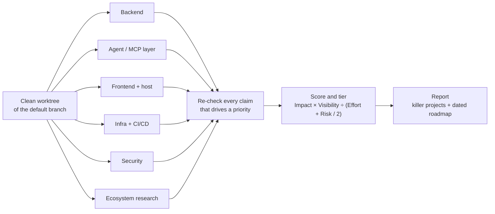

<picture>
  <source media="(prefers-color-scheme: dark)" srcset="./assets/banner-dark.svg">
  
</picture>

<p>
  <a href="./LICENSE"></a>
  
  
</p>

Skills that make Claude Code ship and review work the way a senior engineer does. It reads the real code, backs every claim with evidence, and hands back a short ranked list instead of a wall of notes.

## Install

```bash
claude plugin marketplace add philong-buile/lobi-skills
claude plugin install review-helpers@lobi-skills
claude plugin install design-helpers@lobi-skills
```

Inside a Claude Code session, the same commands work as `/plugin marketplace add philong-buile/lobi-skills` and `/plugin install review-helpers@lobi-skills`.

## Skills

| Skill | What you get | Runs where |
| --- | --- | --- |
| [`pl-staff-review`](./plugins/review-helpers/skills/pl-staff-review/SKILL.md) | A staff-level review of a whole system: six parallel read-only lanes, claims re-checked in code, every idea scored, and a dated roadmap with 3 to 5 killer projects | CLI or desktop |
| [`pl-ship-change`](./plugins/review-helpers/skills/pl-ship-change/SKILL.md) | One feature or fix taken from plan to PR: branch, implement, unit + smoke + end-to-end checks, self-review, a short PR with a smoke-test guide, and a merge only when you ask | CLI or desktop |
| [`pl-pr-review-annotations`](./plugins/review-helpers/skills/pl-pr-review-annotations/SKILL.md) | `[FYI]` comments on a large PR that tell reviewers which hunks matter most | CLI or desktop |
| [`pl-pr-review-request`](./plugins/review-helpers/skills/pl-pr-review-request/SKILL.md) | A ready-to-paste Slack message asking for review, with real PR titles, stack order and a short summary each | CLI or desktop |
| [`pl-pr-autofix`](./plugins/review-helpers/skills/pl-pr-autofix/SKILL.md) | Auto-fix turned on for each new PR, so CI failures and merge conflicts get fixed while you work on something else | Desktop app |
| [`pl-design-review`](./plugins/design-helpers/skills/pl-design-review/SKILL.md) | A frontend design and UX review in a real browser at desktop and mobile widths, ending in a P1/P2/P3 fix list with file:line references | Desktop app |
| [`pl-readme-polish`](./plugins/design-helpers/skills/pl-readme-polish/SKILL.md) | A README redesigned like a popular open-source repo: light/dark banner, factual badges, install first, one feature table, checked on GitHub after the push | CLI or desktop |

Each skill triggers from plain language. A few prompts to start with:

```text
Do a staff-level review of this project before my performance review
Ship this fix: the export button runs twice on a double click
Add FYI comments on PR #42
Draft a review request for PRs 118, 119 and 121
Review the UI of this site and fix the P1 items
Polish the README of this repo like popular open-source projects
```

## How the staff review works



The lanes never edit, commit or push in the reviewed repos, never call cloud APIs, and never print secret values. The report lands in a folder outside git, together with the raw lane reports, so nothing sensitive ends up in the repo.

## Configuration

Two skills read optional lines from your `CLAUDE.md`, user level or project level:

```text
Auto-fix repos: your-org/api, your-org/web
Review-request reviewer: https://your-workspace.slack.com/team/U0000000000
```

Without these lines, `pl-pr-autofix` only offers Auto-fix, and `pl-pr-review-request` writes a plain `@Name` for you to replace.

## Requirements

- [GitHub CLI](https://cli.github.com/) (`gh`), signed in, for the PR skills and the staff review.
- The Claude desktop app (Code tab) for `pl-pr-autofix` and `pl-design-review`. They need the PR monitor and the built-in browser.
- Web search for the ecosystem lane of the staff review.

## Repository layout

```text
.
├── .claude-plugin/marketplace.json     the plugin list
├── assets/                             README images
└── plugins/
    ├── review-helpers/
    │   ├── .claude-plugin/plugin.json
    │   ├── README.md
    │   └── skills/<skill>/SKILL.md     plus references/ and scripts/ where needed
    └── design-helpers/
```

## Contributing

Issues and pull requests are welcome. A skill is one folder with a `SKILL.md`. Keep it self-contained, and check the manifests before opening a PR:

```bash
claude plugin validate .
claude plugin validate plugins/review-helpers
```

## License

[MIT](./LICENSE)
