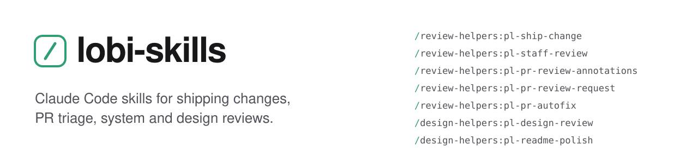
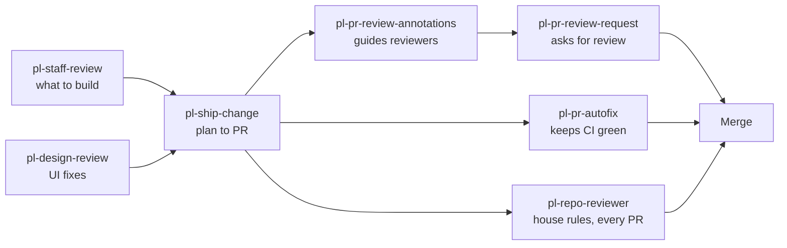

<picture>
  <source media="(prefers-color-scheme: dark)" srcset="./assets/banner-dark.svg">
  
</picture>

<p>
  <a href="https://github.com/philong-buile/lobi-skills/actions/workflows/check.yml"></a>
  <a href="./evals/results/triggers-2026-10-10.md"></a>
  <a href="./LICENSE"></a>
</p>

Eight [Claude Code](https://claude.com/product/claude-code) skills for the parts of engineering that eat the day around the code: shipping a change cleanly, getting a PR reviewed, keeping CI green, and knowing what to build next. Each one follows your repo's own rules, backs every claim with evidence, and stops to ask before anything irreversible.

## Install

```bash
claude plugin marketplace add philong-buile/lobi-skills
claude plugin install review-helpers@lobi-skills
claude plugin install design-helpers@lobi-skills
```

Then ask in plain language. `Ship this fix: the export button runs twice on a double click` is enough; no flags to learn. Every skill also has a slash command, such as `/review-helpers:pl-ship-change`.

## Skills

| Skill | What you get | Runs where |
| --- | --- | --- |
| [`pl-ship-change`](./plugins/review-helpers/skills/pl-ship-change/SKILL.md) | One feature or fix taken from plan to PR: branch, implement, unit + smoke + end-to-end checks, self-review, a short PR with a smoke-test guide, and a merge only when you ask | CLI or desktop |
| [`pl-repo-reviewer`](./plugins/review-helpers/skills/pl-repo-reviewer/SKILL.md) | A reviewer bot for one repo: a read-only subagent that checks every PR against the 8 to 12 rules only that repo has, each backed by `file:line`, with its prompt reviewed against the code and dry-run on a merged PR before it ships | CLI or desktop |
| [`pl-staff-review`](./plugins/review-helpers/skills/pl-staff-review/SKILL.md) | A staff-level review of a whole system: six parallel read-only lanes, claims re-checked in code, every idea scored, and a dated roadmap with 3 to 5 killer projects | CLI or desktop |
| [`pl-pr-review-annotations`](./plugins/review-helpers/skills/pl-pr-review-annotations/SKILL.md) | `[FYI]` comments on a large PR that tell reviewers which hunks matter most | CLI or desktop |
| [`pl-pr-review-request`](./plugins/review-helpers/skills/pl-pr-review-request/SKILL.md) | A ready-to-paste Slack message asking for review, with real PR titles, stack order and a short summary each | CLI or desktop |
| [`pl-pr-autofix`](./plugins/review-helpers/skills/pl-pr-autofix/SKILL.md) | Auto-fix turned on for each new PR, so CI failures and merge conflicts get fixed while you work on something else | Desktop app |
| [`pl-design-review`](./plugins/design-helpers/skills/pl-design-review/SKILL.md) | A frontend design and UX review in a real browser at desktop and mobile widths, ending in a P1/P2/P3 fix list with file:line references | Desktop app |
| [`pl-readme-polish`](./plugins/design-helpers/skills/pl-readme-polish/SKILL.md) | A README redesigned like a popular open-source repo: light/dark banner, factual badges, install first, one feature table, checked on GitHub after the push | CLI or desktop |

### Agents

Two subagents ship with `review-helpers` and run with their own context and tool limits:

| Agent | What it does | Tools |
| --- | --- | --- |
| [`docs-drift-checker`](./plugins/review-helpers/agents/docs-drift-checker.md) | Checks every factual claim in the docs and policy pages against the code, and reports `doc:line`, `code:line` and what is wrong | Read only |
| [`finding-to-test`](./plugins/review-helpers/agents/finding-to-test.md) | Turns one confirmed bug into one test that fails today, without touching the code | Writes test files only |

## How it changes the work

| Task | Without the skill | With the skill |
| --- | --- | --- |
| Ship a fix | Branch, tests, PR template and smoke steps by hand. The end-to-end check is the step that gets skipped, and the PR says "tested" without saying how. | One prompt. It plans first and asks before risky changes, runs unit, smoke and end-to-end checks, and the PR lists what ran with counts and what did not. |
| Review against the house rules | Generic review catches null checks and style. The rule behind last year's outage, and the script that breaks it on purpose, live in one person's head. | A bot per repo runs beside the generic review on every PR, citing the file that holds each rule and naming the deliberate exceptions, so it does not cry wolf. |
| Get a big PR reviewed | Reviewers scroll the whole diff to find the few hunks that matter. | `[FYI] Important / Medium / Minor` comments on the hunks, so review starts where the risk is. |
| Ask for the review | A message typed from memory, with PR titles that drifted from the real ones. | Real titles and links from `gh`, stacked PRs in review order, drafts flagged, one plain sentence each. Never sent for you. |
| CI goes red after you switch tasks | You notice hours later. | Auto-fix wakes the session, fixes the cause and pushes. Review comments are triaged, never answered on GitHub without asking. |
| Decide what to build next | Opinions, and a backlog sorted by whoever spoke last. | Six independent reviews, claims re-checked in code, every idea scored by impact per hour, and a dated roadmap you can defend. |
| Polish the UI or the README | "Looks fine" on one screen size. | Measured findings at desktop and mobile widths, ranked P1/P2/P3 with file:line, and a render check on GitHub. |

## How the skills fit together



## Why engineers can trust them

- **Your repo's rules win.** Skills read `CLAUDE.md`, `AGENTS.md`, `CONTRIBUTING`, the PR template and CI first. Commands, branch names and PR format come from your repo, not from the skill.
- **Evidence, not prose.** Every finding carries a `file:line`, a test count, a measurement or a screenshot. "Done" means a check ran; anything that did not run is listed as not run.
- **Safe by default.** Reviews are read-only. Messages are drafted, never sent. PRs open as drafts. Merges, deploys and public pushes happen only after an explicit yes.
- **Short output.** A ranked list instead of a wall of notes, a 5 to 10 minute smoke-test guide, a two-sentence PR summary.
- **Composable.** The skills hand work to each other, as the diagram shows, so the same rules hold from planning to merge.

## Evaluation

### Checked on every push

[`scripts/check.py`](./scripts/check.py) runs in [CI](./.github/workflows/check.yml) and fails the build on any of these:

| Check | What it catches |
| --- | --- |
| Manifests | `marketplace.json` and each `plugin.json` parse, names match, versions are semver, source folders exist |
| Skill front matter | Every `SKILL.md` has a `name` equal to its folder and a description of at most 1024 characters, which Claude Code uses to pick the skill |
| Links | Every relative link and image in every Markdown file resolves |
| Copy | No em or en dashes in READMEs |
| Script self-tests | `extract_agent_reports.py` and the eval runner pass their own tests |

```bash
python scripts/check.py
```

### Does the right skill fire?

A skill only helps if Claude picks it from a plain-language request. [`evals/run_triggers.py`](./evals/run_triggers.py) runs [19 prompts](./evals/triggers.json) through headless Claude Code inside a small [fixture app](./evals/fixture), with only these plugins loaded, no user settings, and every writing tool disabled. It records the first skill each prompt fires. 16 prompts should fire a specific skill; 3 unrelated prompts should fire none.

| Skill | Prompts | Fired correctly |
| --- | --: | --: |
| `pl-ship-change` | 2 | 6 / 6 |
| `pl-staff-review` | 2 | 6 / 6 |
| `pl-repo-reviewer` | 2 | 6 / 6 |
| `pl-pr-review-annotations` | 2 | 6 / 6 |
| `pl-pr-review-request` | 2 | 6 / 6 |
| `pl-pr-autofix` | 2 | 5 / 6 |
| `pl-design-review` | 2 | 6 / 6 |
| `pl-readme-polish` | 2 | 6 / 6 |
| Unrelated prompts, no skill expected | 3 | 9 / 9 |

**56 of 57 correct** on `claude-opus-5[1m]` with Claude Code 2.1.263, 3 runs per prompt, up to 6 turns each ([full report](./evals/results/triggers-2026-10-10.md)). The eval earned its keep on the way there:

1. **First run, empty repo, 3 turns.** It mostly measured the setup. With no code to look at, the model explored first and ran out of turns before any skill, so the fixture app and the 6-turn budget were added.
2. **Second run: 48 of 51** ([report](./evals/results/triggers-2026-10-08-before-tuning.md)). `pl-ship-change` missed an "implement X and open a PR" prompt twice, and `pl-staff-review` missed an "architecture review" prompt once, because the model started reading code instead. Both descriptions now say to start with the skill.
3. **Third run: 51 of 51** ([report](./evals/results/triggers-2026-10-08.md)).
4. **After adding `pl-repo-reviewer`: 56 of 57.** The new skill fired 6 of 6. One `pl-pr-autofix` run reached for the PR tools with `ToolSearch` before the skill, so it counts as a miss; that description did not change since the 51 of 51 run. The first attempt at this run also showed a runner bug: one slow session hit the 300 s timeout and threw away every result, so a timeout now scores the partial transcript and is labelled in the report.

This measures whether the right skill starts, not how good its output is. The real-work table below covers that.

```bash
python evals/run_triggers.py --runs 3
```

### Used on real work

| Skill | Where | What happened |
| --- | --- | --- |
| `pl-readme-polish` | This README and [lobi_agent](https://github.com/philong-buile/lobi_agent) | Rebuilt both READMEs and checked the render on GitHub. Its link check caught a redirected URL, and its facts-only rule flagged a missing `LICENSE`, which was added after asking. |
| `pl-staff-review` | A private multi-repo production system: desktop app, backend, agent and tool layer, cloud infrastructure | Six lanes ran in parallel and 13 priority-driving claims were re-checked in code before ranking. When the lane output files came back empty, `extract_agent_reports.py` recovered all six reports from the session transcript. |
| `docs-drift-checker`, `finding-to-test` | A private household app | The docs check read 74 claims in four READMEs and the account-deletion page and found 14 stale ones. All 3 spot-checked were real, among them a demo kitchen and an AI mock that no longer exist. Its first run read a checkout that was behind origin, so it now compares against the fetched base. The test writer got one bug that was already fixed: it found the existing test and wrote nothing. On a live rule break it wrote one test, failing on 8 strings, and touched no source file. |
| `pl-repo-reviewer` | Two private production repos: an operations dashboard with a background worker, and a household app with an Android build | Reviewing the first drafts against the code caught 6 rule errors in one bot and 11 of 12 rules needing correction in the other, mostly absolute rules that the code breaks on purpose. The dry runs on already-merged PRs found 4 and 6 issues. All 6 spot-checked were real, including a deleted user's name and photo surviving in shared data. |
| `pl-pr-autofix`, `pl-pr-review-request` | The author's team PRs on a production codebase | Part of the author's PR flow. The private versions carry the team's reviewer and repos; these public versions read them from `CLAUDE.md`. |

## Configuration

Two skills read optional lines from your `CLAUDE.md`, user level or project level:

```text
Auto-fix repos: your-org/api, your-org/web
Review-request reviewer: https://your-workspace.slack.com/team/U0000000000
```

Without these lines, `pl-pr-autofix` only offers Auto-fix, and `pl-pr-review-request` writes a plain `@Name` for you to replace.

## Requirements

- [GitHub CLI](https://cli.github.com/) (`gh`), signed in, for the PR skills, the ship flow and the staff review.
- The Claude desktop app (Code tab) for `pl-pr-autofix` and `pl-design-review`. They need the PR monitor and the built-in browser.
- Web search for the ecosystem lane of the staff review.

## Repository layout

```text
.
├── .claude-plugin/marketplace.json     the plugin list
├── .github/workflows/check.yml         runs scripts/check.py on every push
├── assets/                             banners and the logo (assets/logo/)
├── evals/                              trigger eval: prompts, fixture app, runner, results
├── scripts/check.py                    repository checks
└── plugins/
    ├── review-helpers/                 ship, repo reviewer bot, review, triage, request, auto-fix
    │   ├── agents/<agent>.md           subagents: docs drift, finding to test
    │   └── skills/<skill>/SKILL.md     plus references/, scripts/ and templates/ where needed
    └── design-helpers/                 design review, README polish
```

## Contributing

Issues and pull requests are welcome. A skill is one folder with a `SKILL.md`; keep it self-contained, and add a trigger prompt for it to `evals/triggers.json`. Before opening a PR:

```bash
python scripts/check.py
claude plugin validate .
```

## License

[MIT](./LICENSE)
