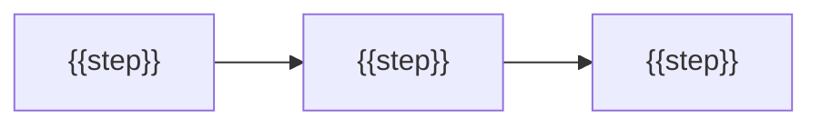

<picture>
  <source media="(prefers-color-scheme: dark)" srcset="./assets/banner-dark.svg">
  
</picture>

<p>
  <a href="./LICENSE"></a>
  
  
</p>

{{One or two sentences: what it does, and why someone would want it.}}

## Install

```bash
{{install command}}
```

## {{Features | Skills | Packages}}

| Name | What you get | Runs where / needs |
| --- | --- | --- |
| [`{{name}}`]({{path to doc}}) | {{outcome in plain words}} | {{where}} |

{{One line introducing the examples:}}

```text
{{example 1}}
{{example 2}}
{{example 3}}
```

## How it works



{{One paragraph about guarantees: what it never does, where output goes.}}

## Configuration

```text
{{config line}}
```

{{What happens when it is absent.}}

## Requirements

- {{tool, with link}}

## Repository layout

```text
.
├── {{path}}     {{comment}}
└── {{path}}     {{comment}}
```

## Contributing

{{Two or three sentences.}}

```bash
{{validate or test command}}
```

## License

[{{LICENSE}}](./LICENSE)
